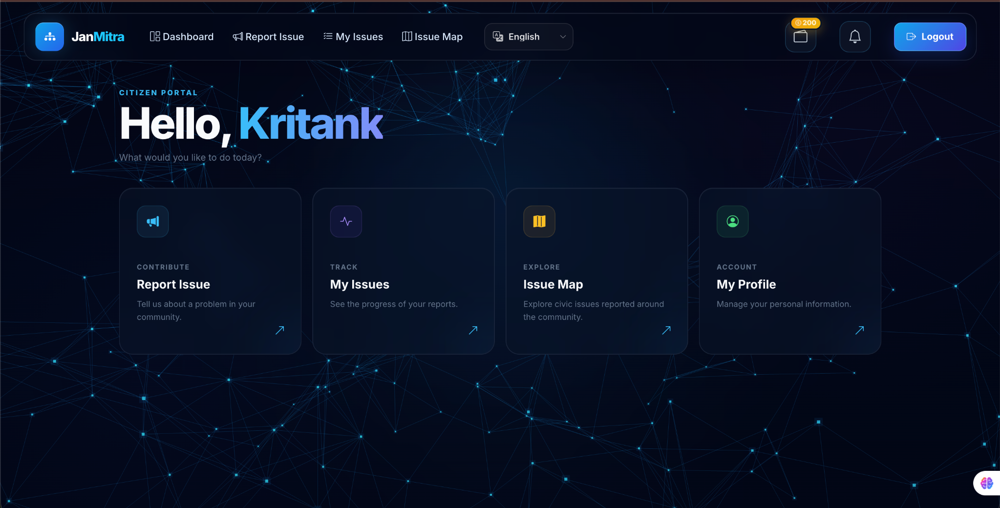
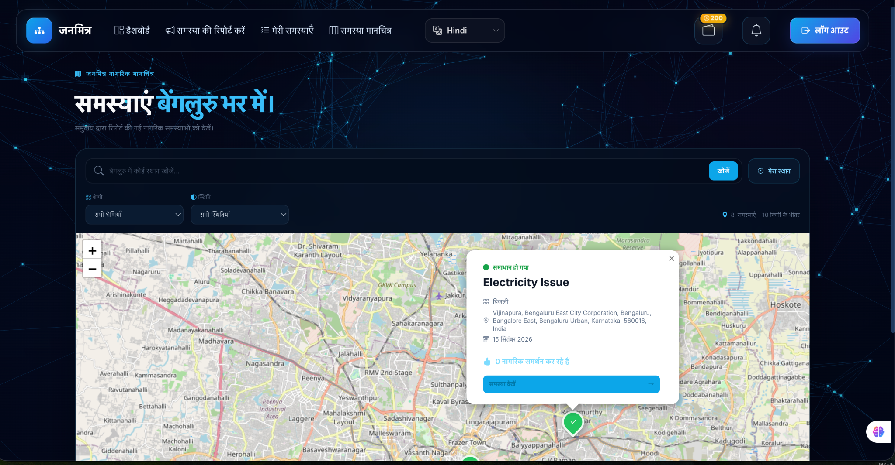
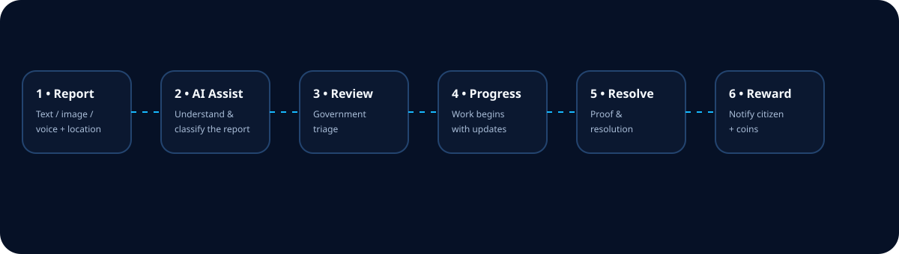
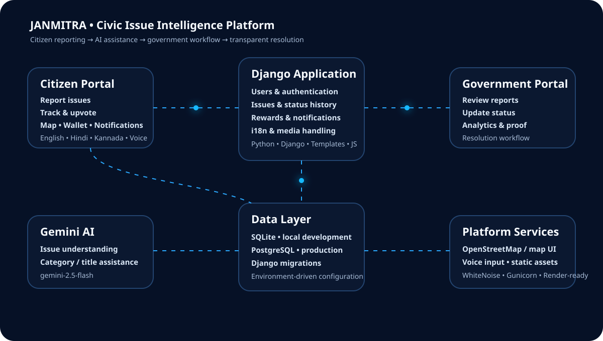

<div align="center">

# 🇮🇳 JanMitra

### **A multilingual, AI-assisted civic issue reporting and resolution platform for Bengaluru**

<p>
  <strong>Report • Locate • Track • Collaborate • Resolve • Reward</strong>
</p>

<p>
  
  
  
  
  
  
</p>

<p>
  <a href="#-overview">Overview</a> •
  <a href="#-features">Features</a> •
  <a href="#-experience">Experience</a> •
  <a href="#-architecture">Architecture</a> •
  <a href="#-setup">Setup</a> •
  <a href="#-deployment">Deployment</a>
</p>

</div>

---

## ✨ Overview

**JanMitra** is a civic-tech platform designed to make reporting and tracking local public issues more accessible, transparent, and engaging.

The platform connects citizens and government users through a single workflow:

> **Citizen report → AI-assisted understanding → Government review → Status updates → Resolution proof → Citizen notification → Reward**

It is designed around a simple principle:

> **A civic report should not disappear after submission. Citizens should be able to understand what happened to it.**

JanMitra combines a responsive citizen portal, a government operations portal, interactive issue mapping, multilingual UI, voice input, AI assistance, notifications, and a reward mechanism into one Django application.

---

## 🖼️ Product Preview

### Citizen Dashboard

<p align="center">
  
</p>

The dashboard uses a dark glassmorphism-inspired interface with a network visualization, focused navigation, issue shortcuts, reward wallet access, notifications, and language selection.

### Multilingual Issue Map

<p align="center">
  
</p>

The issue map combines location-aware civic reports with category/status filters, search, map markers, and localized interface content.

---

## 🎯 Product Goals

| Goal | JanMitra approach |
|---|---|
| Make reporting accessible | Text, image and voice-based reporting |
| Reduce duplicate reporting | Community upvotes and issue visibility |
| Improve issue understanding | Gemini-assisted issue parsing |
| Make location meaningful | Interactive map and issue coordinates |
| Keep citizens informed | Status notifications |
| Support diverse users | English, Hindi and Kannada |
| Create participation incentives | Citizen coin/reward system |
| Support government operations | Government dashboard and analytics |
| Improve transparency | Status history and resolution proof |

---

## 🚀 Features

### 👤 Citizen Portal

- Personalized citizen dashboard
- Report civic issues
- Upload issue images
- Add location information
- Search and browse reported issues
- View personal issue history
- Track issue status
- Upvote existing issues
- View issue details
- Interactive issue map
- Profile management
- Notification center
- Reward wallet
- Multilingual interface
- Voice-assisted reporting

---

### 📝 Smart Issue Reporting

Citizens can submit a civic issue with contextual information such as:

- Issue title / description
- Category
- Location
- Latitude and longitude
- Supporting image
- Voice input
- Additional issue details

The reporting flow is designed to minimize friction while preserving enough information for government-side processing.

---

### 🤖 Gemini AI Assistance

JanMitra integrates **Google Gemini** through a server-side service.

The AI layer can assist with understanding a reported civic problem and returning structured information such as:

- Suggested issue category
- Suggested title
- Reasoning/context for the classification

Current model configuration:

```text
gemini-2.5-flash
```

The Gemini API key is loaded from environment variables and is never intended to be exposed in frontend code.

---

### 🎙️ Voice-to-Text Reporting

JanMitra supports voice-assisted issue entry with Indian language codes including:

```text
en-IN
hi-IN
kn-IN
```

This makes reporting more accessible for users who may prefer speaking instead of typing.

---

### 🌐 Multilingual Experience

JanMitra currently supports:

- 🇬🇧 English
- 🇮🇳 Hindi
- 🇮🇳 Kannada

The application uses Django internationalization with:

```text
LocaleMiddleware
gettext / translate tags
.po translation files
.mo compiled translation files
```

Translation resources are maintained under:

```text
locale/
├── hi/
│   └── LC_MESSAGES/
└── kn/
    └── LC_MESSAGES/
```

The active interface language is used across citizen-facing experiences including dashboards, issue pages, wallet, notifications, map controls, and reporting UI.

---

### 🗺️ Interactive Civic Issue Map

The map provides a geographic view of community-reported issues.

Capabilities include:

- Issue markers
- Category filtering
- Status filtering
- Location search
- Current-location interaction
- Issue detail popups
- Geographic visualization of civic problems

The map experience is designed to turn individual reports into a visible picture of community-level issues.

---

### 👍 Community Upvotes

Citizens can support existing reports rather than creating another duplicate report.

The issue model maintains an upvoter relationship, allowing JanMitra to represent community support around a reported issue.

This creates a simple mechanism for surfacing issues that matter to multiple citizens.

---

### 🏛️ Government Portal

Government users have a dedicated workflow for handling reported civic issues.

Capabilities include:

- Government dashboard
- Issue list
- Issue detail view
- Issue review
- Status updates
- Resolution workflow
- Resolution proof images
- Status history
- Analytics

The government workflow is separated from the citizen experience while operating on the same underlying issue records.

---

### 📊 Government Analytics

The analytics experience provides an operational view of reported issues.

It can be used to understand information such as:

- Issue volume
- Issue categories
- Status distribution
- Resolution activity
- Civic reporting trends

The objective is to turn the reporting database into actionable operational information.

---

### 🔔 Notifications

Citizens receive notifications as their reports move through the workflow.

Supported notification states include:

```text
Issue Submitted
Issue Under Review
Issue In Progress
Issue Resolved
Issue Rejected
Reward
```

Notifications are localized dynamically according to the active language.

---

### 🪙 Citizen Reward System

JanMitra includes a citizen reward mechanism.

When a valid civic issue reported by a citizen is resolved, the reporting citizen can receive coins.

Current conversion:

```text
100 coins = ₹10
```

The wallet provides a transparent view of the citizen's accumulated rewards.

---

### 🧾 Resolution Proof

Government-side resolution can include proof images.

This creates a stronger connection between:

```text
Reported problem
      ↓
Government action
      ↓
Resolution evidence
      ↓
Citizen notification
```

---

## 🔄 Civic Issue Lifecycle



The core workflow is designed around a traceable issue lifecycle:

```text
REPORT
   ↓
AI ASSISTANCE
   ↓
GOVERNMENT REVIEW
   ↓
IN PROGRESS
   ↓
RESOLUTION
   ↓
NOTIFICATION
   ↓
REWARD
```

---

## 🧠 AI + Civic Workflow

```text
Citizen
   │
   │  Text / Image / Voice
   ▼
┌──────────────────────┐
│     JanMitra UI      │
└──────────┬───────────┘
           │
           ▼
┌──────────────────────┐
│     Django Backend   │
└──────────┬───────────┘
           │
           ├──────────────► Gemini AI
           │                   │
           │                   ▼
           │             Category / Title
           │
           ▼
┌──────────────────────┐
│      Issue Model     │
└──────────┬───────────┘
           │
           ▼
┌──────────────────────┐
│ Government Workflow  │
└──────────┬───────────┘
           │
           ▼
     Status History
           │
           ▼
     Citizen Update
           │
           ▼
      Reward / Coins
```

---

## 🏗️ Architecture



### Application Layers

```text
┌──────────────────────────────────────────┐
│              Presentation                │
│ Django Templates • HTML • CSS • JS      │
├──────────────────────────────────────────┤
│              Application                 │
│ Django Views • Forms • Services • URLs   │
├──────────────────────────────────────────┤
│               Domain                     │
│ Users • Issues • Rewards • Notifications │
├──────────────────────────────────────────┤
│             Intelligence                 │
│ Gemini AI • Voice • Localization         │
├──────────────────────────────────────────┤
│               Data                      │
│ SQLite (dev) / PostgreSQL (prod)        │
└──────────────────────────────────────────┘
```

---

## 🧰 Technology Stack

### Backend

| Technology | Purpose |
|---|---|
| Python 3.13 | Application language |
| Django 6.1.1 | Web framework |
| Django ORM | Database abstraction |
| Django Authentication | User authentication |
| Django i18n | Localization |
| Pillow | Image processing |
| python-dotenv | Environment configuration |
| Google GenAI SDK | Gemini integration |

### Frontend

| Technology | Purpose |
|---|---|
| HTML5 | Semantic UI |
| CSS3 | Visual system |
| JavaScript | Client-side interaction |
| Django Templates | Server-rendered interface |
| Bootstrap / icons | UI components where used |
| Leaflet / map UI | Interactive issue map |
| Browser speech capabilities | Voice input |

### Data

```text
Development
└── SQLite

Production
└── PostgreSQL
```

### Production Infrastructure

```text
GitHub
   ↓
Render Web Service
   ├── Django
   ├── Gunicorn
   ├── WhiteNoise
   └── Environment Variables
          ↓
       PostgreSQL
```

---

## 📁 Project Structure

```text
JanMitra/
│
├── apps/
│   ├── issues/
│   │   ├── migrations/
│   │   ├── admin.py
│   │   ├── forms.py
│   │   ├── gemini_service.py
│   │   ├── models.py
│   │   ├── urls.py
│   │   └── views.py
│   │
│   ├── notifications/
│   │   ├── migrations/
│   │   ├── context_processors.py
│   │   ├── models.py
│   │   ├── services.py
│   │   └── views.py
│   │
│   ├── rewards/
│   │   ├── migrations/
│   │   ├── models.py
│   │   └── views.py
│   │
│   └── users/
│       ├── migrations/
│       ├── forms.py
│       ├── managers.py
│       ├── models.py
│       └── views.py
│
├── janmitra/
│   ├── settings.py
│   ├── urls.py
│   ├── asgi.py
│   └── wsgi.py
│
├── locale/
│   ├── hi/
│   │   └── LC_MESSAGES/
│   └── kn/
│       └── LC_MESSAGES/
│
├── static/
│   ├── css/
│   └── js/
│
├── templates/
│   ├── issues/
│   ├── notifications/
│   ├── rewards/
│   └── users/
│
├── manage.py
├── requirements.txt
├── .gitignore
└── README.md
```

---

## 🔐 Security & Configuration

Secrets are intentionally kept outside the repository.

### Local `.env`

```env
GEMINI_API_KEY=your_gemini_api_key
SECRET_KEY=your_secret_key
DEBUG=True
```

### Production environment

Production values should be supplied through the hosting platform rather than committed to Git.

Typical production variables:

```env
SECRET_KEY=...
DEBUG=False
GEMINI_API_KEY=...
DATABASE_URL=...
ALLOWED_HOSTS=...
CSRF_TRUSTED_ORIGINS=...
```

The repository intentionally ignores:

```text
.env
db.sqlite3
media/
venv/
staticfiles/
__pycache__/
```

---

## 🛠️ Local Setup

### 1. Clone the repository

```bash
git clone https://github.com/<your-username>/JanMitra.git
cd JanMitra
```

### 2. Create a virtual environment

```bash
python3 -m venv venv
source venv/bin/activate
```

Windows:

```bash
venv\Scripts\activate
```

### 3. Install dependencies

```bash
pip install -r requirements.txt
```

### 4. Configure environment variables

Create `.env`:

```env
GEMINI_API_KEY=your_gemini_api_key
SECRET_KEY=your_local_secret
DEBUG=True
```

### 5. Run migrations

```bash
python manage.py migrate
```

### 6. Compile translations

```bash
python manage.py compilemessages
```

### 7. Collect static files

```bash
python manage.py collectstatic --noinput
```

### 8. Start the development server

```bash
python manage.py runserver
```

Open:

```text
http://127.0.0.1:8000/
```

---

## 🧪 Verification

Before deployment:

```bash
python manage.py check
```

For production readiness:

```bash
python manage.py check --deploy
```

The application should also be tested across:

- Citizen registration/login
- Government authentication
- Issue reporting
- Image uploads
- Location selection
- Issue map
- Upvotes
- Status transitions
- Notifications
- Rewards
- Gemini assistant
- Voice input
- English
- Hindi
- Kannada

---

## 🚀 Deployment

JanMitra is structured for deployment as a Django web service.

### Planned production architecture

```text
                 ┌─────────────────┐
                 │     GitHub      │
                 └────────┬────────┘
                          │
                          ▼
                 ┌─────────────────┐
                 │     Render      │
                 │  Django Web App │
                 └────────┬────────┘
                          │
             ┌────────────┴────────────┐
             ▼                         ▼
     ┌──────────────┐          ┌──────────────┐
     │ PostgreSQL   │          │ Gemini API   │
     │  Database    │          │ Environment  │
     └──────────────┘          └──────────────┘
```

Production components include:

- Gunicorn
- WhiteNoise
- PostgreSQL
- Environment-based secrets
- Django production security settings
- Static-file collection

### Important media note

Citizen and government-uploaded images are stored under the local `media/` directory during development.

For production, persistent object/file storage should be configured rather than relying on an ephemeral application filesystem.

---

## 🗺️ Roadmap

### Completed

- [x] Citizen authentication
- [x] Government authentication
- [x] Civic issue reporting
- [x] Issue categories
- [x] Location-aware issues
- [x] Interactive issue map
- [x] Community upvotes
- [x] Government issue management
- [x] Status workflow
- [x] Resolution proof
- [x] Government analytics
- [x] Reward / coin wallet
- [x] Notifications
- [x] Gemini AI integration
- [x] Voice-assisted reporting
- [x] English localization
- [x] Hindi localization
- [x] Kannada localization
- [x] Responsive dark UI
- [x] Production-oriented Django configuration

### Deployment / infrastructure

- [ ] GitHub repository
- [ ] Render web service
- [ ] PostgreSQL production database
- [ ] Production environment variables
- [ ] Persistent media/object storage
- [ ] Production domain
- [ ] HTTPS production verification
- [ ] Production monitoring

---

## 💡 Design Philosophy

JanMitra's interface follows a **civic-tech dashboard** visual language rather than a conventional administrative portal.

### Visual principles

**01 — Dark civic interface**

A deep navy foundation provides strong contrast and gives the application a modern technology-oriented identity.

**02 — Glassmorphism**

Cards, navigation, wallet controls and overlays use translucent surfaces, borders and depth to separate information without visually overwhelming the user.

**03 — Network visualization**

The animated network background represents the relationship between:

```text
Citizens ↔ Issues ↔ Government ↔ Community
```

**04 — Color-coded actions**

Blue is used heavily for primary interactions, while status/category accents provide quick visual differentiation.

**05 — Progressive information**

The interface exposes the most important action first and keeps secondary information inside cards, maps, details and notifications.

**06 — Localization-first UI**

The design accounts for different text lengths and scripts instead of treating translation as an afterthought.

---

## 🌍 Accessibility & Inclusion

JanMitra is designed around multiple ways of interacting with a civic reporting system:

```text
Typing
  +
Images
  +
Voice
  +
Multiple Indian languages
  +
Map-based interaction
```

This reduces dependence on a single input method and helps make civic participation more approachable.

---

## 🔄 Data & Domain Model

At the domain level, JanMitra revolves around four major areas:

```text
                    ┌──────────────┐
                    │     User     │
                    └──────┬───────┘
                           │
                           ▼
                    ┌──────────────┐
                    │    Issue     │
                    └───┬──────┬───┘
                        │      │
              ┌─────────┘      └─────────┐
              ▼                          ▼
       ┌──────────────┐           ┌──────────────┐
       │ Notification │           │ StatusHistory│
       └──────────────┘           └──────────────┘
              │
              ▼
       ┌──────────────┐
       │   Rewards    │
       └──────────────┘
```

This structure allows a single civic report to connect:

- the citizen who created it
- government processing
- community interaction
- status history
- notifications
- eventual rewards

---

## 🤝 Contribution

Contributions are welcome.

A typical workflow:

```bash
git checkout -b feature/your-feature
```

Make changes, test them, then:

```bash
git add .
git commit -m "Add: your feature"
git push origin feature/your-feature
```

Open a pull request with:

- What changed
- Why it changed
- Screenshots where relevant
- Testing performed
- Any deployment/configuration changes

---

## 🔒 Responsible Use

JanMitra is a civic engagement and issue-management project.

Users should avoid submitting:

- sensitive personal information
- malicious content
- fraudulent reports
- content unrelated to civic issues

AI-generated classifications should be treated as assistance to the reporting workflow rather than a substitute for human government review.

---

## 👨‍💻 Project

**JanMitra — AI-Assisted Multilingual Civic Issue Reporting Platform**

Built with:

```text
Python
Django
JavaScript
HTML
CSS
Gemini AI
SQLite / PostgreSQL
OpenStreetMap-based mapping
Django i18n
```

### Core concept

> **Make civic reporting visible, understandable, trackable, and engaging.**

---

<div align="center">

### 🇮🇳 JanMitra

**Connecting citizens, communities and civic administration through technology.**

<br>

<p>
  <strong>Report it.</strong> &nbsp; <strong>Track it.</strong> &nbsp; <strong>Resolve it.</strong> &nbsp; <strong>Improve Bengaluru.</strong>
</p>

</div>
